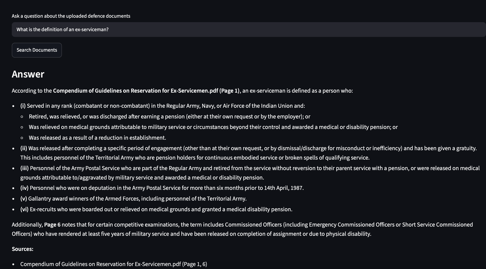

# 🛡️ DefenceDocs AI

### Retrieval-Augmented Document Intelligence for Defence Policy & Veteran Welfare

> **DefenceDocs AI is an AI-powered knowledge assistant that enables users to search and query defence policy, government, and veteran-welfare documents using semantic retrieval and source-grounded generative AI.**

Instead of manually searching through lengthy government documents, DefenceDocs AI retrieves the most relevant document passages and generates an answer grounded in the retrieved evidence — while exposing the **source document, page number, and retrieval distance** for verification.



---

## 🚀 Why DefenceDocs AI?

Government and defence-policy documents are often:

* 📚 Long and difficult to navigate
* 🔎 Difficult to search semantically
* 📄 Distributed across multiple documents
* 🧩 Filled with policy-specific terminology
* ⚠️ Sensitive to inaccurate interpretation

DefenceDocs AI addresses this by combining **document processing + vector search + RAG + LLM generation** into a single query pipeline.

---

# ✨ Key Features

### 🔍 Semantic Document Search

Users can ask natural-language questions instead of relying on exact keyword matches.

**Example:**

> *"What is the definition of an ex-serviceman?"*

The system retrieves semantically relevant sections from the indexed document corpus.

---

### 🧠 Retrieval-Augmented Generation

DefenceDocs AI follows a RAG architecture:

```text
User Question
      ↓
Semantic Retrieval
      ↓
Relevant Document Chunks
      ↓
Context Construction
      ↓
Gemini LLM
      ↓
Grounded Answer
```

The LLM generates its response using the retrieved document context rather than treating the query as a standalone general-knowledge question.

---

### 📑 Source-Grounded Answers

Every generated answer can be traced back to retrieved documents.

The application exposes:

* Document name
* Page number
* Retrieval distance

Example:

```text
Source:
Compendium of Guidelines on Reservation for Ex-Servicemen.pdf

Page: 1
Distance: 0.769
```

This makes the system significantly more useful for **policy, compliance, and information-retrieval workflows** where traceability matters.

---

### ⚡ FastAPI Backend

The RAG pipeline is exposed through a REST API built using **FastAPI**.

Current endpoint:

```http
POST /ask
```

Example request:

```json
{
  "question": "What is the definition of an ex-serviceman?"
}
```

Example response:

```json
{
  "answer": "...",
  "sources": [
    {
      "file_name": "Compendium of Guidelines on Reservation for Ex-Servicemen.pdf",
      "page_number": 1,
      "distance": 0.769
    }
  ]
}
```

The API is also automatically documented through FastAPI's OpenAPI/Swagger interface.

---

### 🎨 Streamlit Interface

A lightweight Streamlit frontend provides:

* Document question input
* Search interaction
* AI-generated responses
* Source visualization
* Page-level source information
* Defence-oriented visual design

The frontend communicates with the FastAPI backend rather than directly interacting with the RAG pipeline.

---

# 🏗️ System Architecture

```text
                    ┌──────────────────────┐
                    │   Defence Documents  │
                    │   PDF / Documents    │
                    └──────────┬───────────┘
                               │
                               ▼
                    ┌──────────────────────┐
                    │ Document Processing   │
                    │ & Chunking            │
                    └──────────┬───────────┘
                               │
                               ▼
                    ┌──────────────────────┐
                    │ Vector Representation │
                    │ & FAISS Index         │
                    └──────────┬───────────┘
                               │
                               ▼
                     ┌───────────────────┐
                     │   User Question   │
                     └─────────┬─────────┘
                               │
                               ▼
                    ┌──────────────────────┐
                    │ Semantic Retrieval   │
                    │ Top Relevant Chunks  │
                    └──────────┬───────────┘
                               │
                               ▼
                    ┌──────────────────────┐
                    │ Context Construction │
                    └──────────┬───────────┘
                               │
                               ▼
                    ┌──────────────────────┐
                    │ Gemini Generative AI │
                    └──────────┬───────────┘
                               │
                               ▼
                    ┌──────────────────────┐
                    │ Grounded Response    │
                    │ + Source Metadata    │
                    └──────────┬───────────┘
                               │
                               ▼
                    ┌──────────────────────┐
                    │ FastAPI /ask         │
                    └──────────┬───────────┘
                               │
                               ▼
                    ┌──────────────────────┐
                    │ Streamlit Frontend   │
                    └──────────────────────┘
```

---

# 🔬 RAG Pipeline

The core intelligence layer follows a retrieval-augmented generation workflow.

### 1. Document Ingestion

Defence and veteran-welfare documents are collected into the document corpus.

### 2. Document Processing

Documents are processed and transformed into manageable text chunks while preserving document metadata.

Processed artifacts include:

```text
data/
└── processed/
    ├── chunks.json
    ├── documents.json
    └── document_metadata.csv
```

### 3. Vector Indexing

Processed document chunks are represented in a vector-searchable format and stored using **FAISS**.

### 4. Query Retrieval

When a user asks a question, the system performs semantic retrieval to identify the most relevant chunks from the indexed corpus.

### 5. Context Construction

Retrieved chunks are assembled into contextual evidence for the generative model.

### 6. Answer Generation

Gemini generates a natural-language response based on the retrieved context.

### 7. Source Attribution

The system returns source metadata alongside the generated response, allowing users to inspect where the information came from.

---

# 🧰 Tech Stack

| Layer           | Technology                     |
| --------------- | ------------------------------ |
| Language        | Python                         |
| RAG             | Retrieval-Augmented Generation |
| Vector Search   | FAISS                          |
| LLM             | Google Gemini                  |
| Backend         | FastAPI                        |
| Frontend        | Streamlit                      |
| API             | REST / OpenAPI                 |
| Data Processing | Python                         |
| Version Control | Git + GitHub                   |

---

# 📂 Project Structure

```text
DefenceDocs-AI/
│
├── data/
│   └── processed/
│       ├── chunks.json
│       ├── documents.json
│       └── document_metadata.csv
│
├── notebooks/
│   └── ...
│
├── src/
│   ├── api/
│   │   └── main.py
│   │
│   ├── vector_store.py
│   ├── rag.py
│   └── generator.py
│
├── app.py
├── requirements.txt
├── .gitignore
└── README.md
```

---

# 🔌 API

## Health Check

```http
GET /health
```

Used to verify that the backend is operational.

## Ask a Question

```http
POST /ask
```

Request:

```json
{
  "question": "What is the definition of an ex-serviceman?"
}
```

Response:

```json
{
  "answer": "According to the retrieved defence document...",
  "sources": [
    {
      "file_name": "Compendium of Guidelines on Reservation for Ex-Servicemen.pdf",
      "page_number": 1,
      "distance": 0.769
    }
  ]
}
```

---

# 🖥️ Interface

The application provides a lightweight document-intelligence interface designed around the defence/government domain.

### Core UI flow

```text
Ask Question
      ↓
Search Documents
      ↓
Retrieve Relevant Evidence
      ↓
Generate Answer
      ↓
Review Sources
```


# ⚙️ Running Locally

### 1. Clone the repository

```bash
git clone https://github.com/Trisha2910tinaaaaa/DefenceDocs-AI.git

cd DefenceDocs-AI
```

### 2. Create a virtual environment

```bash
python3 -m venv venv
```

### 3. Activate it

```bash
source venv/bin/activate
```

### 4. Install dependencies

```bash
pip install -r requirements.txt
```

### 5. Configure environment variables

Create:

```text
.env
```

Add:

```env
GEMINI_API_KEY=your_api_key_here
```

### 6. Start FastAPI

```bash
uvicorn src.api.main:app --reload
```

Backend:

```text
http://127.0.0.1:8000
```

Swagger documentation:

```text
http://127.0.0.1:8000/docs
```

### 7. Start Streamlit

Open another terminal:

```bash
cd DefenceDocs-AI
source venv/bin/activate
streamlit run app.py
```

The Streamlit application will be available locally through the URL displayed in the terminal.

---

# 🧪 Example Query

### User

```text
What is the definition of an ex-serviceman?
```

### DefenceDocs AI

The system retrieves relevant sections from:

```text
Compendium of Guidelines on Reservation for Ex-Servicemen.pdf
```

and produces a structured response with source references such as:

```text
Page 1
Page 4
Page 6
```

This allows users to move from:

**Question → Evidence → Answer → Source**

rather than simply receiving an unsupported LLM response.

---

# 🎯 Engineering Highlights

This project demonstrates practical implementation of:

* Retrieval-Augmented Generation
* Semantic document retrieval
* Vector search with FAISS
* LLM-powered question answering
* Source attribution
* Metadata-aware retrieval
* REST API development
* FastAPI backend architecture
* Streamlit frontend development
* Environment-based API key management
* Git-based project versioning

---

# 🔮 Future Improvements

Potential extensions include:

* 📤 User document upload and automatic indexing
* 🔐 Authentication and role-based access
* 📚 Multi-document conversational sessions
* 💬 Conversation memory
* 🔎 Advanced metadata filtering
* 📊 Retrieval evaluation and benchmarking
* 🧪 RAG evaluation using faithfulness/relevance metrics
* ☁️ Cloud deployment
* 📈 Query analytics
* 🗂️ Document collections by policy domain

---

# 👩‍💻 Author

**Trisha Soni**

Computer Science Engineering | AI/ML | Generative AI | Backend Systems

Interested in building practical AI systems that combine **machine learning, retrieval systems, APIs, and product-focused interfaces**.

---

## ⭐ Why this project matters

DefenceDocs AI explores how generative AI can be used beyond generic chatbots by combining **retrieval, structured document processing, vector search, and source attribution** to build a more trustworthy information-access layer for complex policy documents.

---

## 📌 Project Status

```text
████████████████████████████████  MVP COMPLETE
```

**Current capabilities**

```text
✓ Document processing
✓ Processed document corpus
✓ Vector retrieval
✓ FAISS search
✓ RAG pipeline
✓ Gemini generation
✓ Source attribution
✓ FastAPI backend
✓ Swagger API documentation
✓ Streamlit frontend
✓ Local end-to-end execution
```

---

